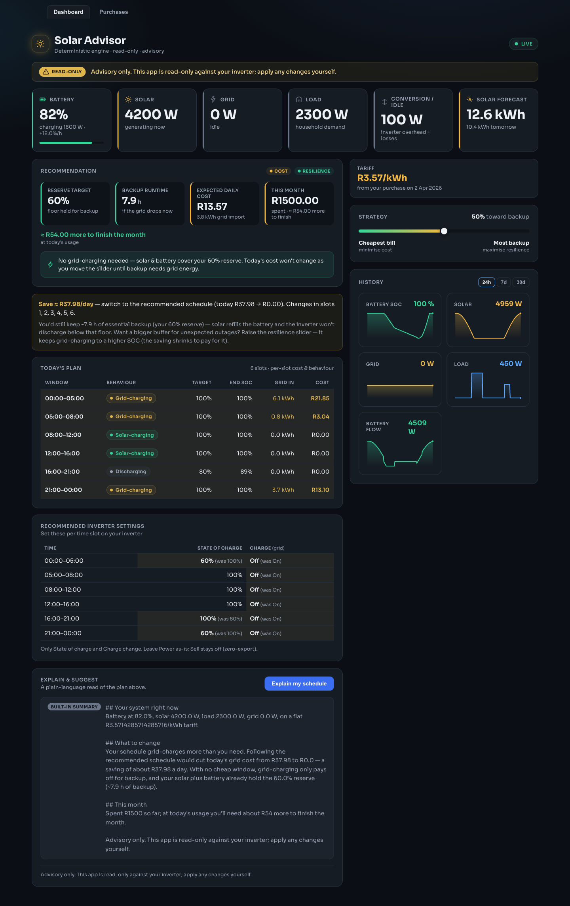
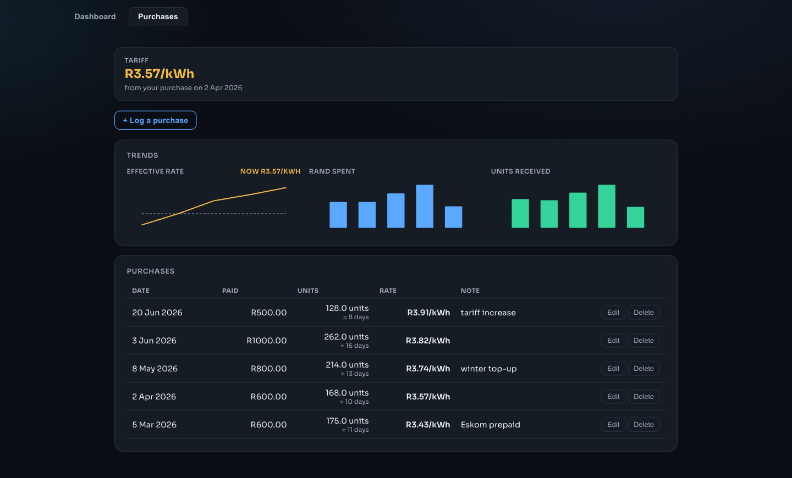

# Solar Advisor

A clean, self-hosted **advisory** dashboard for a home solar + battery system running
[SolarAssistant](https://solar-assistant.io). It reads inverter telemetry and the
work-mode schedule over local MQTT, runs a **deterministic** optimisation engine to plan
the day, and uses an LLM **only** to explain the engine's output in plain language. It
never writes to the inverter.

[](LICENSE)
Python 3.12 · FastAPI · Vue 3 + TypeScript · Docker

> ⚠️ **Advisory only — strictly read-only.** Solar Advisor never publishes to MQTT and
> never changes an inverter setting. Every recommendation is shown for you to apply
> manually, and an advisory disclaimer is visible on the dashboard at all times.

---

## Screenshots

> Rendered against **seeded demo data** — the numbers are illustrative, not real meter
> readings.

**Dashboard** — live tiles (battery %/h, solar, grid, load, inverter conversion, PV
forecast), today's plan beside the **recommended inverter settings**, the headline R/day
saving with its resilience trade-off, the cost↔resilience slider, and the guarded
plain-language explanation. Every figure is produced by the deterministic engine.



**Prepaid tracker** — log each electricity purchase; the app derives your effective
R/kWh, trends it over time, and estimates how many days each top-up covers.



---

## The thesis: a hard boundary between the engine and the explanation

The point of this project is the line drawn down the middle of it — and that it's
**enforced in code**, not just documented.

```
              ┌──────────────────────────────────────────────────────┐
  MQTT  ──▶   │  Collector → SQLite        Deterministic engine        │
 (read-only)  │  (telemetry history)    (schedule, costs, reserve SOC, │
              │                          backup hours, recommendation) │
              └───────────────────────┬──────────────────────────────┘
                                      │  every number the user sees
                                      ▼  is computed here, verifiably
              ┌──────────────────────────────────────────────────────┐
   FastAPI    │  /api/dashboard  /api/history  /api/purchases         │
              │  /api/explain  ── LLM narrates the engine's output,    │
              │                   guarded so it can ONLY restate       │
              │                   numbers the engine produced          │
              └───────────────────────┬──────────────────────────────┘
                                      ▼
   Vue 3 SPA  │  live tiles · current-vs-recommended schedule · the    │
  (nginx)     │  cost↔resilience slider · prepaid tracker · forecast   │
```

- **The deterministic engine owns the decisions and the numbers.** Battery schedule,
  per-slot grid-import cost, reserve SOC, expected daily bill, backup runtime, the
  recommended inverter settings — all of it comes from explicit, unit-tested Python. No
  model is in the loop for any figure you act on. An [import-linter] contract forbids the
  `engine` package from importing any I/O, network, storage, or LLM module, so the purity
  is enforced by CI, not convention.
- **The LLM only narrates.** `/api/explain` asks Claude to describe the plan in plain
  language. A **provenance guard** checks the generated text against the engine's facts:
  if the explanation cites a number the engine didn't produce, the LLM reply is
  **withheld** and the app falls back to a deterministic, engine-only summary — so a
  hallucinated figure can never masquerade as advice, and the user never hits a dead end.
- **The cost↔resilience slider re-runs the engine.** Moving it from "cheapest bill" to
  "most backup" re-evaluates the schedule deterministically and refreshes every number —
  the LLM is never asked to optimise anything.

[import-linter]: https://import-linter.readthedocs.io/

## What it does

- **Live tiles** — battery SOC + charge/discharge rate (%/h), solar, grid
  (importing/exporting), load, an inverter **conversion/idle** figure, and a **solar
  forecast** tile (today + tomorrow).
- **Today's plan vs. recommended settings** — the live 6-slot schedule with per-slot
  behaviour and cost, shown **beside a "recommended inverter settings" sheet** (Time /
  State of charge / Charge) that highlights exactly what to change and the **R/day saving**
  — with the resilience trade-off spelled out so "switch grid-charge off" never reads as
  "lose your backup".
- **Cost↔resilience slider** — re-runs the engine (debounced) on change.
- **Data-derived tariff** — log your prepaid electricity purchases (date, rand, units);
  the engine derives its marginal R/kWh from the *lowest effective rate over a trailing
  window* of your real purchases, falling back to a configured rate when there's no
  history. Charts the effective R/kWh over time, and shows each purchase's "≈ N days of
  cover".
- **Forward prepaid view** — "spent this month · ≈ R X more to finish the month at today's
  usage", derived from real grid usage (no monthly-bill fiction on a prepaid meter).
- **Real solar forecast** — an own provider that sums per-plane [Forecast.Solar] estimates
  for a split array, cached with a TTL and falling back to static on any error. No
  third-party home-automation dependency.
- **Explain & suggest** — a plain-language read of the plan from `/api/explain`, behind
  the provenance guard + a kill-switch + a rate limit; degrades to the built-in summary.
- **History** — 24h / 7d / 30d trend charts (server-side bucketed so 30 days stays fast),
  hand-rolled SVG with hover tooltips.

[Forecast.Solar]: https://forecast.solar/

## Architecture

| Layer        | Stack                                                              |
| ------------ | ------------------------------------------------------------------ |
| Collector    | Python, async MQTT (read-only) → SQLite, with telemetry retention  |
| Engine       | Pure Python, deterministic, fully unit-tested (import-linter-gated)|
| API          | FastAPI (`/api/dashboard`, `/api/history`, `/api/purchases`, `/api/explain`, `/api/health`) |
| Explanation  | Claude via the Anthropic SDK, behind a provenance guard + deterministic fallback |
| Frontend     | Vue 3 + TypeScript (strict), Vite, Vitest; SVG charts, no chart lib |
| Delivery     | Docker Compose: collector + API + nginx-served SPA                 |

The frontend is served as static files by nginx, which proxies `/api/*` to the API
container — so the SPA calls a same-origin API in production.

## Running it

From `backend/` (where `docker-compose.yml` lives), create a `.env` with at least the
required variables, then bring the stack up:

```bash
cat > .env <<'EOF'
SA_MQTT_HOST=your-solarassistant-host
ANTHROPIC_API_KEY=sk-ant-...        # only needed if the Explain panel is enabled
SA_FORECAST_SOURCE=forecast_solar   # real Forecast.Solar; omit to use a static estimate
EOF
docker compose up --build
```

Then open:

- Dashboard (SPA via nginx): <http://localhost:8080>
- API directly: <http://localhost:8000>

Without a real inverter you can still explore the **Purchases** tab and the API — it's
fully self-contained; the live dashboard shows a "waiting for data" state until telemetry
arrives.

### Configuration (selected env vars; full set in `backend/src/solar_advisor/config.py`)

| Variable | Default | Purpose |
| --- | --- | --- |
| `SA_MQTT_HOST` | _(required)_ | SolarAssistant MQTT broker host (read-only). |
| `ANTHROPIC_API_KEY` | _(required if explain on)_ | Claude API key for the Explain panel. |
| `SA_FORECAST_SOURCE` | `static` | `static` or `forecast_solar` (real per-plane forecast). |
| `SA_PV_ARRAYS` | _(2×2.5 kWp NE/SW)_ | JSON list of `{tilt, azimuth, kwp}` planes. |
| `SA_LAT` / `SA_LON` | `-33.92` / `18.42` | Site coordinates for the forecast. |
| `SA_TIMEZONE` | `Africa/Johannesburg` | Local day for the forecast's today/tomorrow. |
| `SA_TARIFF_RATE` / `SA_TARIFF_FIXED_CHARGE` | `3.56` / `600` | Fallback rate + fixed charge. |
| `SA_TARIFF_WINDOW_DAYS` | `90` | Trailing window for the data-derived marginal rate. |
| `SA_MAX_CHARGE_POWER_W` / `SA_MAX_GRID_CHARGE_POWER_W` | `7950` / `3640` | Battery charge power vs the lower grid-charge cap. |
| `SA_BATTERY_NOMINAL_KWH` / `SA_BATTERY_SOC_FLOOR_PCT` | `15` / `20` | Usable capacity / reserve floor. |
| `SA_TELEMETRY_RETENTION_DAYS` | `90` | Collector prunes telemetry older than this (purchases are never pruned). |
| `SA_EXPLAIN_ENABLED` | `true` | Kill-switch for the LLM Explain panel. |

With `SA_EXPLAIN_ENABLED=false` the dashboard runs fully without any LLM — the
deterministic engine and every number it produces are unaffected.

## Development

```bash
cd backend  && make install && make check   # ruff, mypy --strict, import-linter, pytest
cd frontend && npm install && npm run check  # eslint, vue-tsc, vitest, vite build
```

## How it was built

This is a clean-room personal project built spec-first. Each feature went through a
written **spec → bite-sized plan → test-driven implementation** with a two-stage review
(spec-compliance, then code-quality) before merge. The full design specs and build plans
(A–P) live in [`docs/superpowers/`](docs/superpowers/) — they double as a record of the
engineering approach: TDD throughout, small reviewable commits, and the lint/type/
import-contract/test gates enforced on every change.

## License

[MIT](LICENSE) © Riaan Schoeman
